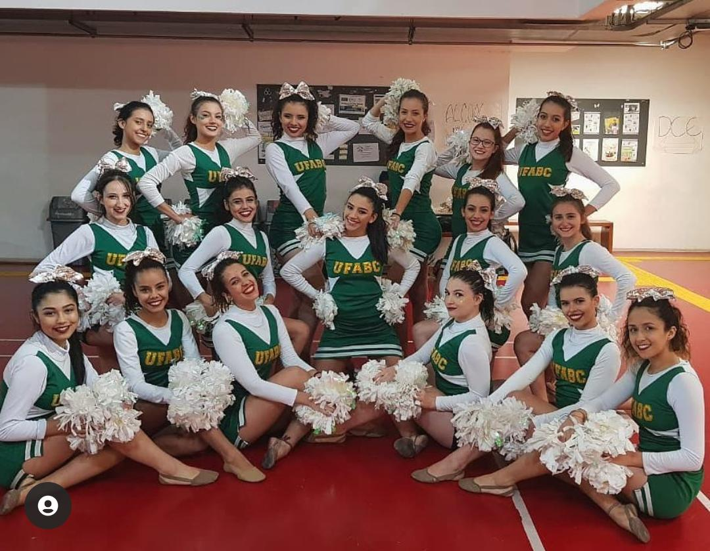

 
 # NICE TO MEET YOU!
<!--
  INTRO PROFILE
-->

Bem Vindo ao meu perfil do github! Sou uma desenvolvedora com um perfil eclético, apesar de trabalhar com tecnologia sou apaixonada por estudos sociais e arte. Aqui utilizo para trabalhar e pessoalmente compilo arquivos e projetos especiais, espero que meu README te guie a entender meu perfil, habilidades e trabalhos. Para dúvidas, sugestões ou até mesmo um papo, minhas informações seguem abaixo.

Welcome to my github profile! I am a developer with an eclectic profile, despite working with technology I am passionate about social studies and art. Here I use to work and personally compile files and special projects, I hope that my README guides you to understand my profile, skills and jobs. For questions, suggestions or even a chat, my information follows below.

<!--
  CONTACT
-->
## CONTACT

 

  
 

 

  
 

 

  
 

 

  
 

 
 
 

<!--
<table style="border-color: transparent;">
 <tbody style="border-color: transparent;">
  <tr style="border-color: transparent;">
   <td style="border-color: transparent;"></td>
   <td style="border-color: transparent;"></td>
   <td style="border-color: transparent;"></td>
   <td style="border-color: transparent;"></td>
  </tr>
 </tbody>
</table>

  
 
 
 

-->

<!--
  WORK
-->

## WORK
SEE MY RESUME [HERE]().

<table>
 <tbody>
  <tr>
    <td align="center"></td>
    <td align="center"></td>
  </tr>
  <tr>
    <td align="center"><b>PROGRAMMING</b></td>
    <td align="center"><b>TECHNOLOGIES</b></td>
  </tr>
  
  
  <tr>
   <td>
    
   
   
   
   
   </td>
   
   <td>
    
     
     
     
     
     
   </td>
  </tr>
  
  <tr>
    <td align="center"><b>DATA</b></td>
    <td align="center"><b>SITES AND APPS ANALYSIS</b></td>
  </tr>
  
  <tr>
    <td>    
     
     
     
    </td>
    <td>
    
     
     
   </td>
  </tr>
 </tbody>
</table>

<!--

  
  

  STATS
-->

<!--
  PROJECTS
-->
## PROJECTS

<b>[Corona Datasource](http://datasource.coronacidades.org/help)</b>
 
[here](https://github.com/ImpulsoGov/coronacidades-datasource).
 
At [@ImpulsoGov](https://github.com/ImpulsoGov).
 
 

<b>[Escola Segura](https://escolasegura.coronacidades.org/)</b>
 
[here](https://github.com/ImpulsoGov/escolasegura).
 
At [@ImpulsoGov](https://github.com/ImpulsoGov).
 

<!--
  ME
-->
## ME
I love:
<table style="border-color: transparent;">
 <tbody style="border-color: transparent;">
  <tr style="border-color: transparent;">
   <td style="border-color: transparent;">
     
    Books
     Nothing like a good book.</td>
   <td style="border-color: transparent;">
     
    Dance
     I'm not good, but I keep trying.</td>
   <td style="border-color: transparent;">
     
    Travel
     And butterflies in stomach.</td>
   <td style="border-color: transparent;">
    
    Help
     Improve the world.</td>
  </tr>
 </tbody>
</table>

<!--
  SIGNATURE
-->

  

